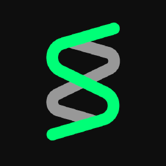
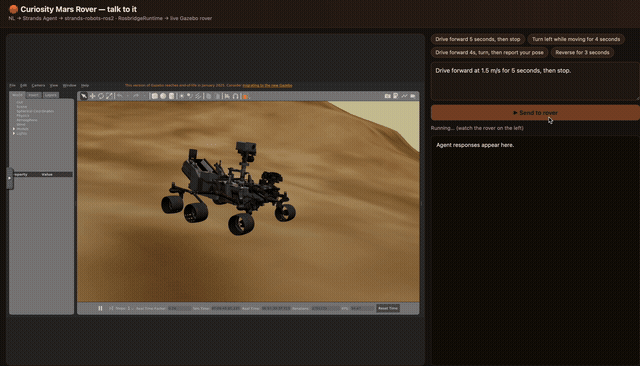
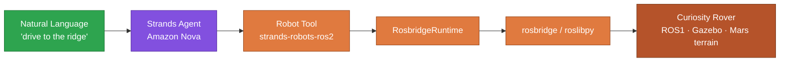
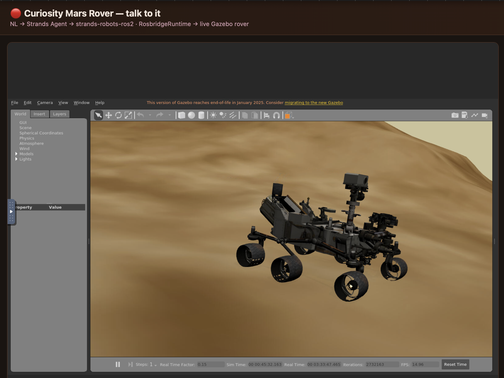
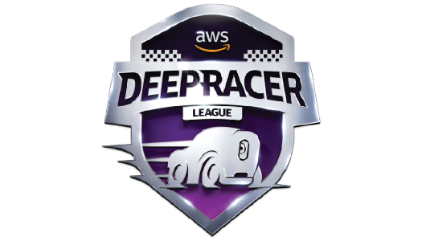
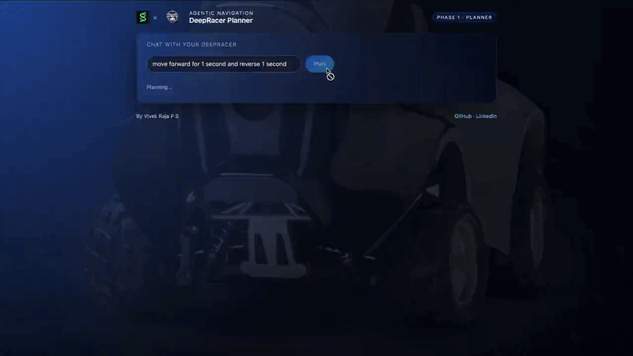
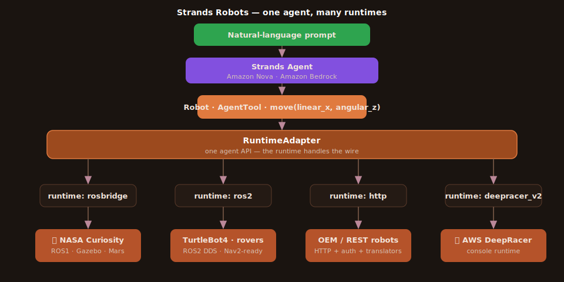

<div align="center">

&nbsp;&nbsp;&nbsp;
&nbsp;&nbsp;&nbsp;


# 🪐 Mars Curiosity Rover Agent

### Type a sentence — watch a NASA Mars rover drive itself.

**A [Strands Agents](https://github.com/strands-agents/sdk-python)–powered,
Amazon Nova LLM–driven Mars rover.** Natural-language control of a NASA Curiosity
rover & AWS DeepRacer — with autonomous Nav2 + live SLAM — built on the **Strands
Agents** SDK and driven by **Amazon Nova**, Amazon's large language model (LLM) on
AWS Bedrock.

<sub>Strands Agents × Amazon Nova × NASA · <code>strands-robots-ros2</code></sub>

[](https://github.com/strands-agents/sdk-python)
[](https://aws.amazon.com/ai/generative-ai/nova/)
[](http://wiki.ros.org/rosbridge_suite)
[](LICENSE)

*Believed to be the first **Amazon Nova**–driven **NASA Curiosity** Mars rover — in a high-fidelity Gazebo simulation built on real NASA/JPL rover meshes and Martian terrain, with full **autonomous Nav2 navigation + live SLAM mapping** on ROS2 rovers.*

</div>

<div align="center">

### ▶ Natural language in — a NASA Mars rover drives itself out.



<sub>An <b>Amazon Nova</b> LLM agent reasons about your prompt, calls a tool, and the real NASA Curiosity rover moves — live in a high-fidelity Gazebo simulation.</sub>

</div>

---

You type *"navigate to the ridge, then report your pose"* — an **Amazon Nova** LLM
agent reasons, picks a tool, and a rover executes it in a **high-fidelity Gazebo
simulation** (real NASA/JPL Curiosity meshes, physically-simulated Martian terrain).
Live, in your browser.

**Two ways to drive — one agent, a real toolbox** (`move` · `navigate_to` · `get_pose` · `cancel`):
- 🕹️ **Teleop** — `move(linear_x, angular_z)` drives the real **NASA Curiosity** (6-wheel rocker-bogie) across Martian terrain.
- 🧭 **Autonomous** — `navigate_to(x, y)` runs **Nav2 path-planning + obstacle avoidance + live SLAM mapping** on ROS2 rovers in Gazebo. The agent *chooses* which to call.

`strands-robots-ros2` is a **forward extension** of [Strands Robots](https://github.com/strands-labs/robots)
on the [Strands Agents](https://github.com/strands-agents/sdk-python) SDK. Where the
upstream framework focuses on LeRobot manipulation, this charts the **mobile,
multi-runtime direction** — a single `RuntimeAdapter` seam that already drives
robots over **ROS2 (DDS), ROS1 (rosbridge), and HTTP**, and is architected to grow
to any robot, on any transport, with no change to the agent.

## How it works



## Web demo — prompt box beside the live rover

<div align="center"></div>

```bash
python examples/web/server.py        # open http://localhost:5000
```

A one-file Flask UI puts a prompt box (with quick prompts) next to the live Gazebo
view. Type → the rover moves.

## Quickstart

```python
# Teleop — drive the real NASA Curiosity (ROS1, over rosbridge):
from strands import Agent
from strands_robots_ros2 import Robot

Agent(tools=[Robot("curiosity", robot="curiosity")])(             # -> RosbridgeRuntime
    "Drive Curiosity forward 4 meters, then turn left, then report your pose.")
```

```python
# Autonomous — Nav2 path-planning + live SLAM on a ROS2 rover:
from strands_robots_ros2 import Robot
from strands_robots_ros2.skills.nav2 import navigate_to, get_pose, cancel_navigation

Agent(tools=[Robot("turtlebot4", robot="turtlebot4"), navigate_to, get_pose, cancel_navigation])(
    "Navigate to (3.0, 1.5), avoid obstacles, then report your pose.")
```

```bash
pip install "strands-robots-ros2[rosbridge]"
```

See [`examples/`](examples/) for the agent + web UI, and
[`examples/README.md`](examples/README.md) for standing up the Curiosity sim
(ROS1 Noetic + Gazebo + rosbridge).

## 🏎️ Also supports AWS DeepRacer

<div align="center"></div>

The same `RuntimeAdapter` seam drives a **1/18-scale AWS DeepRacer** — natural
language → Amazon Nova → the car plans, navigates, and adapts in real time. That
work lives in the companion project
**[strands-agentic-deepracer](https://github.com/Vivek0712/strands-agentic-deepracer)**;
its HTTP/ROS2 runtimes (`runtime/http`, `runtime/deepracer_v2`) ship here too.

<div align="center"></div>

```python
Robot("aws_deepracer", robot="aws_deepracer")     # ROS2 runtime
```

## Multiple runtimes, one agent API

The core idea: **one `RuntimeAdapter` seam, many transports.** The agent always
speaks the same `{linear_x, angular_z}` move API — the runtime handles the wire.

<div align="center"></div>

| Runtime | Reaches | Example robot | Status |
|---|---|---|---|
| `rosbridge` | **ROS1** & any rosbridge-exposed robot (roslibpy) | NASA **Curiosity** | ✅ shipped |
| `ros2` | **ROS2** (DDS) — **Nav2 + live SLAM** autonomous nav | TurtleBot4-class rovers, DeepRacer | ✅ shipped |
| `http` | HTTP/JSON control APIs | OEM/REST robots | ✅ shipped |
| `deepracer_v2` | AWS DeepRacer console | **AWS DeepRacer** | ✅ shipped |
| `gazebo` / `isaac` / `newton` sim backends | sim-hosted robots | — | 🔭 direction |

**Built-in capabilities**
- 🧭 **Autonomous Nav2 navigation + live SLAM** — `skills/nav2.py` gives the agent `navigate_to(x, y)`: path planning, obstacle avoidance, and live mapping on ROS2 rovers (demonstrated in Gazebo).
- **One agent API across every runtime** — swap the robot, not the code.
- **Pluggable auth** (cookie / bearer / API-key) + **payload translators** (Twist→servo, passthrough) for HTTP robots.
- **Safety clamping** (max velocity / duration / watchdog) enforced at the adapter boundary.
- **Registry-driven** — a robot is a JSON entry (`curiosity` is ~25 lines); a user-overlay registry adds robots without forking.
- **AgentTool lifecycle** — `move`, task start/poll/abort, observation schema.

**Direction & roadmap** (where this arm is headed, beyond upstream)
- 🛰️ **More robots** — JPL Open-Source Rover, more ROS2/ROS1 platforms (each a registry entry).
- 👁️ **Vision-language grounding** — *"drive to the red rock"* via a perception policy.
- 🗺️ **Persistent map & episodic memory** for multi-session missions.

> The pattern is deliberately broad: **any robot, any transport, one agent.**
> Curiosity and DeepRacer are the first two of many.

## Credits & sources

- **[Strands Agents SDK](https://github.com/strands-agents/sdk-python)** — the agent runtime.
- **[Strands Robots](https://github.com/strands-labs/robots)** (Apache-2.0, Amazon) — the framework this extends; structure/conventions adapted from its README.
- **[Amazon Nova](https://aws.amazon.com/ai/generative-ai/nova/)** on Amazon Bedrock — the model driving the robots.
- **NASA / JPL** — open-source Curiosity rover 3D models, via the **[mark-gl/curiosity_mars_rover_ws](https://github.com/mark-gl/curiosity_mars_rover_ws)** Gazebo sim.
- **[strands-agentic-deepracer](https://github.com/Vivek0712/strands-agentic-deepracer)** — the DeepRacer agent (logo + demo GIF from that repo).
- **[rosbridge_suite](https://github.com/RobotWebTools/rosbridge_suite)** + **[roslibpy](https://github.com/gramaziokohler/roslibpy)** — the ROS1↔Python bridge.

> Curiosity rover models courtesy NASA/JPL-Caltech. The simulation is a third-party
> ROS1 asset and is **not** bundled here. Logos belong to their respective owners.

## Powered by Strands Robots

> **Powered by [Strands Robots](https://github.com/strands-labs/robots)** —
> customized by **Vivek Raja** for Mars Rover Agents and other ROS2 robots.

## Licensing & Use — please read

This repository is **multi-licensed**, and **attribution / citation is required**
for any use (see [`NOTICE`](NOTICE) and [`CITATION.cff`](CITATION.cff)).

| Part | License | Use |
|---|---|---|
| Components derived from upstream `strands-robots` (`runtime/*` except `rosbridge.py`, `registry/`, `robot.py`, `utils.py`) | **Apache-2.0** ([`LICENSE`](LICENSE)) | open; keep notices |
| **Original code** (`runtime/rosbridge.py`, the `curiosity` registry entry, `examples/`, the web UI) | **PolyForm Noncommercial 1.0.0** ([`LICENSE-NONCOMMERCIAL.md`](LICENSE-NONCOMMERCIAL.md)) | **non-commercial only — commercial use needs the author's written permission** |
| **Original media** (`assets/curiosity_rover.gif`, `assets/rover.png`) | **CC BY-NC-ND 4.0** ([`assets/MEDIA-LICENSE.md`](assets/MEDIA-LICENSE.md)) | share with attribution, non-commercial, no derivatives |

> Building on Apache-2.0 upstream means the *derived* portions can't be made
> permission-only — but the **original code, media, and the "Curiosity Rover
> Agent" name** are protected as above. **To use any of this commercially, or to
> remove attribution, contact the author for permission.** Not legal advice.
